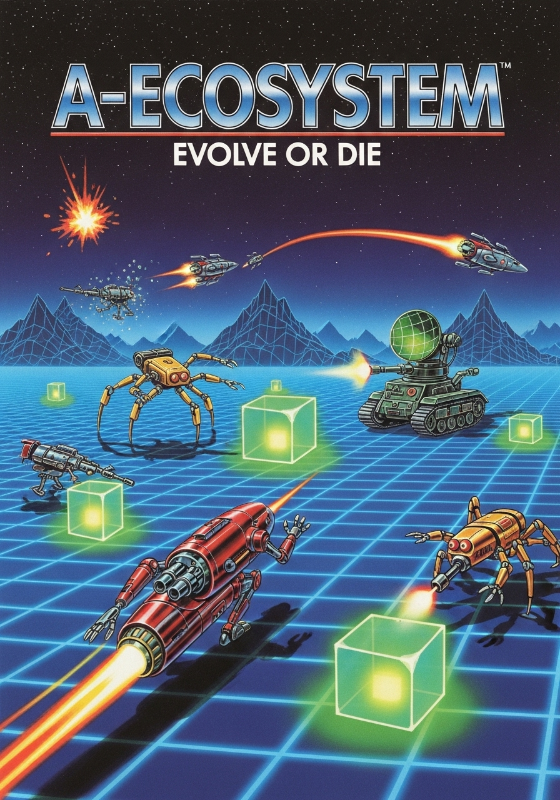
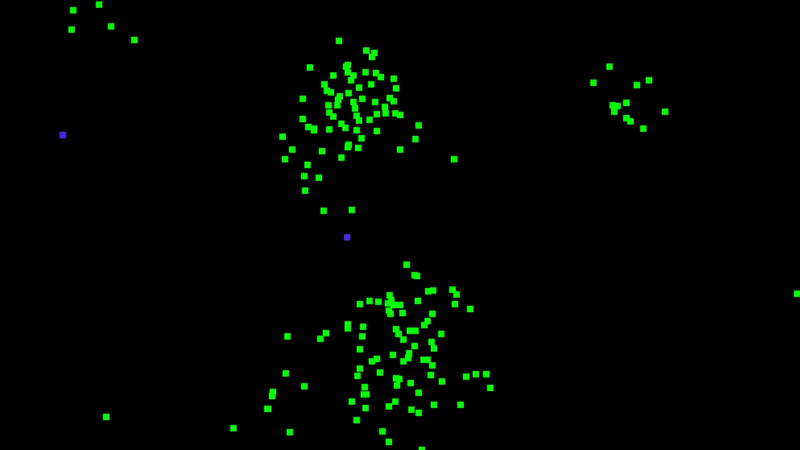
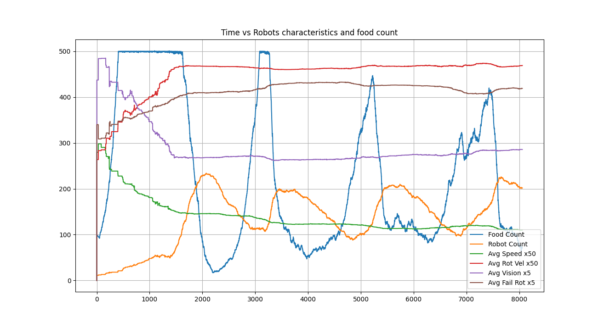

(I'm a freaking fan of Atari covers)


A-Ecosystem (Artificial Ecosystem) is a digital laboratory where simple bots
evolve to survive. These 'robots' compete for limited resources and, upon 
gathering enough energy, pass their genetic traits to the next generation.

This project showcases how, from a simple set of rules —genetic diversity 
and natural selection— a complex ecosystem arises, complete with distinct
survival strategies, evolutionary trade-offs, and dynamic population cycles.



# Index
1. [How did I get the idea](#how-did-i-get-the-idea)
2. [Characteristics](#key-features)
3. [Gallery](#gallery)
4. [How does it work](#how-does-it-work)
5. [Installation and usage](#installation-and-usage)
6. [How to contribute](#how-to-contribute)
7. [Licence](#licence)


# How did I get the idea
About five years ago, while I was trying to learn about AI on YouTube, I found a video of an artificial ecosystem where digital bugs would eat and reproduce. I was thrilled by it and, as a 15-year-old, I naively thought it would be an easy project to replicate. Oh, how wrong I was.

Back then, I had no idea what classes were. I tried to build everything in one giant function that returned a list of attributes, and every operation meant wrestling directly with that list (I didn't even know how to use dictionaries). Needless to say, the project flopped the moment I tried to add a new feature.

But after I began studying Computer Science (and finally learned about OOP, thanks to a Java-only curriculum), I finally felt I had the skills to tackle this project again.

So when I got a week off, I started working on it. I finished the first complete version in about six hours—and that includes time for a movie and a meal.

I have to admit, I thought it would take longer. It had to... I didn't wait five years just to finish it in less than a day, right?

Well, after the code was done, I decided to graph the simulation's data to get more insight, maybe for a school presentation. That's when I discovered the project's true depth: the unpredictability of the environment, how it behaved like a real population, and the realization that this was anything but a simple project.

# Key Features:

- **Evolution by Natural Selection**:
    Robots must eat to survive and reproduce. Only the fittest pass their genes on, while the unfit are removed from the simulation.

- **Genetics for movement and vision**:
    Each robot has a unique genome that defines its speed, agility, vision, and other behaviors that mutate over generations.

- **Dynamic Ecosystem**:
    The population of robots and the availability of food fluctuate, creating emergent cycles of abundance ("boom") and scarcity ("bust").

- **Data analysis**:
    The simulation automatically generates .csv log files, ready to be analyzed with the included plotting scripts or any tool of your choice.

- **Real-time visualization**:
    Built with Pygame, allowing you to watch the simulation.

# Gallery


Simulation of the game.


A graph generated by the built in plotter.

# How does it work

All of the work is done by the robots and their genes. When they reproduce, its offspring inherits these genes with a slight chance of mutation, so that the population will adapt over generations. 

The primary genes are:

- velocity: Determines the robot's speed. The robot will move at this speed without a chance to stop. It comes great to cover long distances to get more food, but comes at a higher energy cost, requiring more frequent feeding.

- rot_vel (Rotational Velocity): It tells how quickly the robot can turn. High agility is crucial for reacting to nearby food and to have a lower radius for getting food.

- vision: The radius within which a robot can detect food. A wide field of view allows for better long-term planning, but the simulation has shown that this trait often comes with evolutionary trade-offs.

- prob_fail_rot (Rotation Failure Probability): Represents the robot's clumsinnes. This trait often causes the robot to "loose" the food for a second, but can occasionally result in an unexpected maneuver to go for the food.

# Installation and usage

Follow these steps to get the simulation running on your local machine.

Prerequisites

Make sure you have Python 3.9 or newer installed.

1. Clone the Repository

First, clone this repository to your local machine:

```
git clone https://github.com/Thrinkler/A-Ecosystem.git
cd A-Ecosystem
```
2. Create and Activate a Virtual Environment (optional, but recommended)

```
# Create the virtual environment
python3 -m venv venv

# Activate it (macOS/Linux)
source venv/bin/activate

# Or activate it (Windows)
.\venv\Scripts\activate
```

3. Install Dependencies

Install all the required libraries using the requirements.txt file:

```
pip install -r requirements.txt
```

4. Run the Simulation

To start the simulation with the real-time visualizer, run:

```
python -m src.main
```

Log files (.csv) will be automatically generated in the logs/ directory. You can analyze them using the scripts found in the analysis/ folder or with your own tools.

```
python plotter/plot.py
```

# How to contribute
Contributions are what make the open-source community such an amazing place to learn, inspire, and create. Any contributions you make are greatly appreciated.

If you have an idea for an improvement, please follow these steps:

1. Fork the Project.

2. Create your Feature Branch (git checkout -b feature/AmazingFeature).

3. Commit your Changes (git commit -m 'Add some AmazingFeature').

4. Push to the Branch (git push origin feature/AmazingFeature).

5. Open a Pull Request.

You can also simply open an issue with the tag "enhancement" to discuss a new feature or idea.

# Licence
This project is distributed under the MIT License. See the [LICENSE](LICENSE) file for more information.
